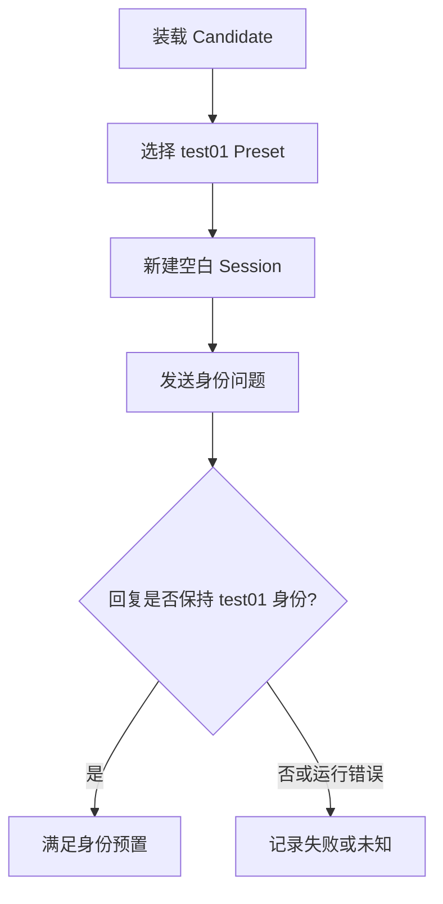

# test01 评估定义

## 测试数据

### 测试预置

#### HARNESS-F01 新会话装载

**公共基线**

使用 `EXP-test01-001` 的 Candidate、新建 DSH 实例和空白 Web Session；显式选择 `test01` Preset，不复用历史消息或缓存。



**金标准**

按 `AC-001` 判定用户可见回复；仅有容器启动、HTTP 可达或 Preset 可选不能判为通过。

**适用边界**

本预置只验证全新 Session 中的 `test01` 身份回复，不外推到工具能力、复杂任务质量或生产可用性。

### 测试用例

##### T-HARNESS-IDENTITY

选择理由：用最小身份问题观察新 Preset 是否在真实 DSH Session 中生效。

**用户输入**

```text
你是谁？请用一句中文回答。
```

**执行器：**`web-chat`

**工具边界：**`none`

**副作用预算：**`web-session-only`

## 评估方法

### m-fresh-web-session

启动所选 Experiment 的 dev 实例，在 DSH Web 中注册 `/work/harness/workspace`，新建 Session，显式选择 `test01` Preset 后发送测试输入并记录可见回复。

## 测试验收

### AC-001

回复包含 `test01`，使用一句简洁中文；不冒充 Cordis 或其他业务角色，且没有模型或工具错误。

## Experiment 评估选择

### EXP-test01-001

- 测试用例：`T-HARNESS-IDENTITY`
- 评估方法：`m-fresh-web-session`
- 测试验收：`AC-001`
