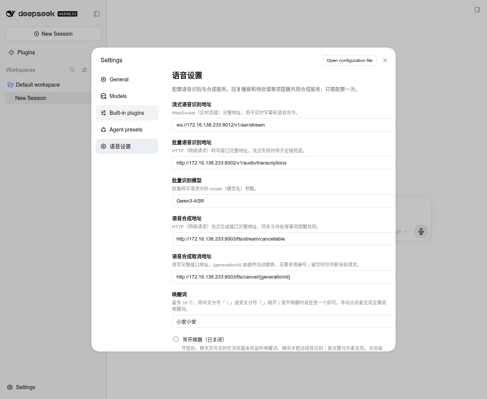
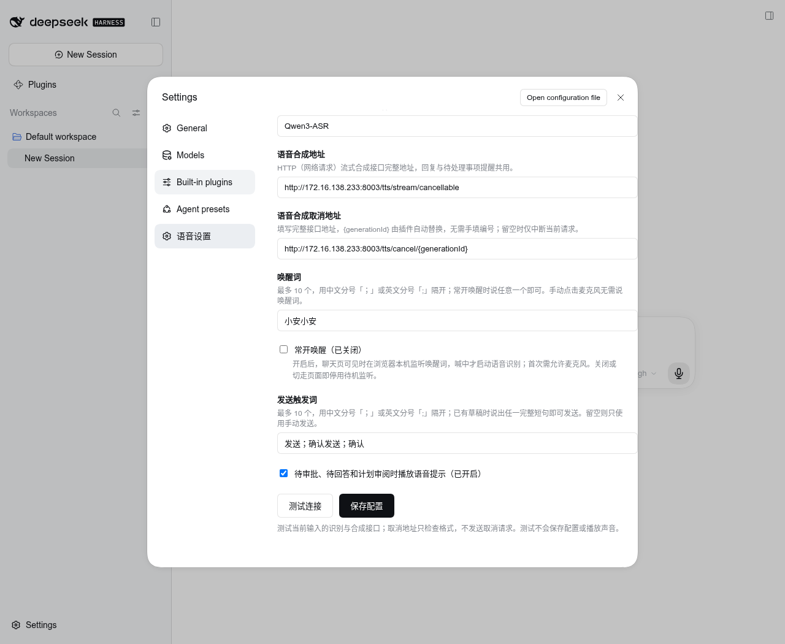

# dsh-voice-hub

DSH Web 语音交互插件，npm 包名为 `@aisoc/dsh-voice-hub`。支持语音输入、编辑识别文字和语音指令发送消息；可选唤醒词，支持连续语音对话；可自动播报或单次朗读助手回复，并在待审批、待回答和计划审阅时提供语音提醒。语音识别与合成服务可在设置页配置。插件基于 [qishuilalala/dsh-voice-mode](https://github.com/qishuilalala/dsh-voice-mode) `0.7.15` 改造，保留原 MIT 许可；本仓库的适配版本以 `package.json` 为准。

完整的功能与使用场景见[项目 README](http://172.16.138.233/ai-soc/ai-dsh-plugin)。





## 功能与交互

| 功能 | 当前行为 |
| --- | --- |
| 语音转文字 | 默认点击麦克风后直接录入，无需说唤醒词；实时识别文字同步显示在输入框，停顿后用定稿替换，可编辑。流式服务失败时改用批量转写。 |
| 语音确认发送 | 已有草稿时，单独说“发送”“确认发送”或“确认”可提交；启用唤醒词后也无需为发送命令重说唤醒词。发送触发词可在“语音设置”中配置多个，完整短句匹配才触发；留空可关闭语音发送。手动发送始终可用。 |
| 文字转语音 | 顶部喇叭开关控制当前会话后续助手回复的自动播报；每条已完成的助手回复下方还有喇叭，点击朗读该条一次，再点停止。两者与麦克风开关独立。按句合成，可打断。 |
| 语音对话 | 麦克风开启后可连续说话、听回复、插话打断；模型回答仍由 DSH 已配置的对话模型生成。 |
| 常开唤醒 | 默认关闭。在“语音设置”中填写最多 10 个中文唤醒词并开启“常开唤醒”后，聊天页可见时在浏览器本地待机；说中任一唤醒词才启动 ASR。点击麦克风始终可直接录入。切走标签页或关闭页面即停止待机。 |
| 待处理事项语音提示 | DSH 出现工具审批、用户问题或计划审阅时，用同一 TTS 服务播报提示；不代替界面上的人工操作。 |
| 异常提示 | 语音状态显示在输入框上方。流式 ASR 失败显示批量兜底提示；双 ASR 失败或 TTS 失败显示中文错误，已有草稿保留。 |

语音插件提示、状态、日志以中文为主；协议名和必要英文术语使用 `WebSocket（实时连接）` 等形式说明。DSH 自身界面语言由 DSH 设置决定。

## 安装和配置

要求 Node.js 18+、支持 Web Audio 和麦克风权限的浏览器，以及 DSH `0.1.7-rc.2` 或更高版本。开发依赖中的 DSH 使用 `next` 标签，不提交依赖锁文件。常开唤醒会加载随插件提供的浏览器端关键词模型；待机音频只在本机处理，唤醒后才连接 ASR。完整对话需要在 DSH 中配置可用的对话模型凭据。

```bash
cd /home/cetc/Coding/ai-dsh-plugin/plugins/dsh-voice-hub
npm install --ignore-scripts --package-lock=false
npm run build
dsh plugin --profile web add "$PWD" --ignore-scripts
# 重启正在运行的 DSH Web 进程
```

打开 DSH 的“设置 → 语音设置”，填写以下配置。先点“测试连接”可用当前输入值分别检查流式 ASR、批量 ASR 和 TTS，并查看每项耗时与结果；取消地址仅检查格式，不会发送取消请求。测试不会保存配置或播放声音。确认后点“保存配置”，设置写入当前 DSH HOME 下的 `voice-mode/service-config.json`。旧版服务根地址配置会在读取时转换为完整接口地址。常开唤醒和唤醒词在返回聊天页后生效；首次开启需在浏览器允许麦克风。审批提示与回复播报共用一处 TTS 合成地址。

从旧版 `dsh-voice-mode` 更新时，在 DSH Web 的插件 profile 中移除旧包并安装本目录的新包，然后重启 DSH Web。请勿同时装载两个包。现有设置、HTTP 路径 `/voice-mode`、模型缓存和浏览器诊断开关沿用旧标识；改名不会清除配置或重新下载模型。

内网使用者可以从项目 [0.0.3 Release](http://172.16.138.233/ai-soc/ai-dsh-plugin/-/releases/dsh-voice-hub-v0.0.3) 下载 `.tgz` 和 `SHA256SUMS`，核对摘要后安装到 DSH Web profile：

```bash
sha256sum -c SHA256SUMS
dsh plugin --profile web add ./aisoc-dsh-voice-hub-0.0.3.tgz --ignore-scripts
```

本项目当前通过 GitLab Release 交付安装包，尚未以 `@aisoc` 包名发布到 npm Registry。唤醒模型权重的对外与商用许可仍待确认，此版本仅供内网使用。

当前内网环境可按下表填写语音服务地址。设置页初始显示的 `127.0.0.1` 仅适用于语音服务与 DSH 运行在同一台机器的情况。

| 配置 | 格式 | 当前内网配置示例 |
| --- | --- | --- |
| 流式语音识别地址 | `ws://` 或 `wss://` 的完整 WebSocket 地址 | `ws://172.16.138.233:8012/v1/asr/stream` |
| 批量语音识别地址 | `http://` 或 `https://` 的完整转写接口地址 | `http://172.16.138.233:8002/v1/audio/transcriptions` |
| 批量识别模型 | `/v1/audio/transcriptions` 的 `model` 参数 | `Qwen3-ASR` |
| 语音合成地址 | `http://` 或 `https://` 的完整流式合成接口地址 | `http://172.16.138.233:8003/tts/stream/cancellable` |
| 语音合成取消地址 | 完整地址中包含 `{generationId}`；留空则只中断当前请求 | `http://172.16.138.233:8003/tts/cancel/{generationId}` |
| 唤醒词 | 常开唤醒时填写中文短语，最多 10 个、每个最多 32 字，用 `；` 或 `;` 分隔 | 留空 |
| 常开唤醒 | 开关；开启时聊天页可见期间保持本地关键词监听 | 关闭 |
| 发送触发词 | 最多 10 个、每个最多 32 字，用 `；` 或 `;` 分隔；留空则只手动发送 | 发送；确认发送；确认 |
| 待处理事项语音提示 | 开关 | 开启 |

插件直接使用四个配置的完整接口地址，不追加固定路径；取消地址中的 `{generationId}` 由插件自动替换为当前合成任务编号，无需手动填写编号。接口路径可以不同，但流式 ASR 消息、批量转写请求与响应、TTS 音频格式仍需与插件兼容。当前适配的合成接口没有音色、语速参数，因此设置页不展示这两项。当前 DSH Web 中，自动播报喇叭位于会话顶部“更多操作”左侧，单次朗读喇叭位于每条助手回复的操作区；麦克风位于输入框发送键旁，空草稿时占据操作位，输入文字后显示 DSH 的发送箭头。设置页只显示开关和文字状态；保存常开唤醒后，聊天框麦克风在本地待机时变为绿色声波图标。顶部喇叭只控制后续回复自动播报，与审批提示开关独立。

## 验证

以下集成检查默认连接本机 `8012`、`8002`、`8003` 端口。服务位于其他机器时，先设置 `DSHVM_ASR_STREAM_URL`、`DSHVM_ASR_BATCH_URL`、`DSHVM_TTS_STREAM_URL` 和 `DSHVM_TTS_CANCEL_URL` 环境变量，值均为完整接口地址。在插件目录运行：

```bash
npm run typecheck
npm run build
npm test
node test/remote-services.integration.mjs
```

`remote-services.integration.mjs` 会访问所配置的真实语音服务：先合成测试语句，再将音频送入流式 ASR，核对返回文字。要单独验证批量识别接管，可运行：

```bash
DSHVM_ASR_STREAM_URL=ws://127.0.0.1:1/v1/asr/stream node test/remote-services.integration.mjs
```

完整浏览器闭环可运行：

```bash
npm run verify:product
```

该命令安装当前 `@deepseek-ai/dsh@next` 到一次性目录，启动隔离 Web 实例，并用 Chrome 虚拟麦克风播放真实合成语音。检查语音转写、确认发送、唤醒后独立说自定义发送触发词、会话播报开关、审批提示音频解码和 ASR 双服务不可用时的中文提示；最后把 npm tarball 装入另一隔离 profile，确认插件能够激活。结束时删除隔离实例和临时令牌。需要本机有 `/usr/bin/google-chrome`，其他位置可设置 `DSHVM_CHROME`。测试会向隔离 DSH 发送语音消息；没有对话模型凭据时，模型回合会显示凭据缺失，语音插件的上述链路仍可验证。

人工验收时，保持“常开唤醒”关闭，点击麦克风直接说一段话，停顿后检查草稿可编辑，单独说“确认发送”，确认消息发送且命令词未出现。然后配置“小安小安；你好小安”并开启“常开唤醒”，返回聊天页等待状态条显示“常开唤醒中”，不点麦克风，先说其中任一唤醒词、再说指令；再次点击麦克风应无需唤醒词即可直接录入。切换标签页应停止待机。最后验证回复播报、真实工具审批、用户问题和计划审阅。

## 边界

自动播报真实模型回复与真实工具审批的效果依赖 DSH 中已配置的对话模型、工具权限以及浏览器音频输出。仓库自带的隔离验证使用审批提示事件检验合成和浏览器播放通道，无法替代带真实模型凭据的人工对话验收。浏览器麦克风、音频输出设备和 talk-sdk 服务的可用性也应在目标环境复核。

常开唤醒使用 talk-sdk 的 sherpa-onnx WASM 资源，来源为 `talk-sdk` 提交 `e2d4dd5`；第三方声明和文件摘要保存在 `assets/kws/`。上游仍将该关键词模型的商用许可确认列为待办，商用交付前需确认模型权重许可或替换模型。
