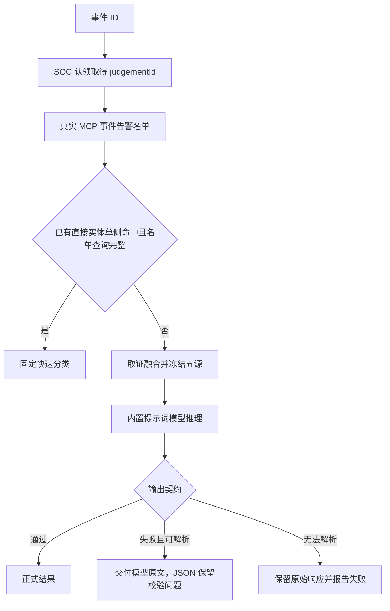

# threat-analysis（独立模式历史口径）

当前开发与评测入口已迁入 [security-operations-expert](../security-operations-expert/evaluation.md) 的 EXP-007。下文冻结为独立模式的历史比较口径，旧实例和运行记录保留，不再作为新增功能的维护位置。

输入 SOC 威胁事件 ID，使用真实 MCP 获取事件、关联告警及名单；已有直接实体单侧命中时快速分类，否则补充取证、固定五源融合、冻结输入，使用本项目内置的威胁研判提示词执行模型推理和输出契约校验。

本项目包含威胁研判所需的取证与融合代码、MCP 工具定义、提示词和输出契约；部署运行不依赖原验证项目的目录、文件或 Python 环境，只连接配置指定的 MCP 和模型服务。原项目仅作为迁移来源记录。内置[威胁研判提示词](../../evolution/experiments/EXP-threat-analysis-001/candidate/dsh/managed/threat-analysis/prompts/threat-analysis-system.txt)随智能体资产装载，由工具按自身目录读取。

DSH 负责接收请求、调用工具和展示结果；工具内的独立研判模型只读取冻结五源输入与固定提示词。外层会话不得重新推理或改写结论。快速分类和完整研判成功后，程序生成摘要 JSON、网页 Markdown 与 HTML 报告，通过 DSH 原生本地适配器，将摘要作为正式助手消息保存和展示，跳过外层模型的第二次生成。工具区仅显示执行状态与运行 ID，完整技术数据保留在元数据中；后续对话恢复原模型。可解析的模型结果即使校验失败也交付，校验详情保留在 JSON；取证、请求或 JSON 解析失败才展示失败说明，不自动重试。原始 result 和运行状态保留在工具元数据及独立运行目录中。

快速分类沿用已验证规则，包括关联告警部分缺失时已有直接实体仍可命中。白名单存在已知误分类；history 尚未接入真实查询；五源模型可能给出非法证据路径。模型原始结论与契约状态必须区分，契约失败不表示模型没有输出，也不能将其结论称为已核实。

评估口径见下文。首个迁移实验及运行说明见 [EXP-threat-analysis-001](../../evolution/experiments/EXP-threat-analysis-001/hypothesis.md)。

## 当前代码入口

代码只保留一套当前实现，按职责命名；Git 和实验记录保存演进历史。

| 模块 | 职责 |
|---|---|
| [dsh_runner.py](../../evolution/experiments/EXP-threat-analysis-001/candidate/dsh/managed/threat-analysis/dsh_runner.py) | DSH 工具入口、路由结果和模型调用编排 |
| [evidence_collection.py](../../evolution/experiments/EXP-threat-analysis-001/candidate/dsh/managed/threat-analysis/evidence_collection.py) | MCP 取证、快速分类分流、有限扩展和五源冻结 |
| [fast_classification.py](../../evolution/experiments/EXP-threat-analysis-001/candidate/dsh/managed/threat-analysis/fast_classification.py) | 名单查询完整性与确定性分类规则 |
| [mcp_gateway.py](../../evolution/experiments/EXP-threat-analysis-001/candidate/dsh/managed/threat-analysis/mcp_gateway.py) | MCP 网关调用和响应处理 |
| [fusion_pipeline.py](../../evolution/experiments/EXP-threat-analysis-001/candidate/dsh/managed/threat-analysis/fusion_pipeline.py) | 事件与告警字段归一化 |
| [incident_scope.py](../../evolution/experiments/EXP-threat-analysis-001/candidate/dsh/managed/threat-analysis/incident_scope.py) | 实体归一、去重聚合、时间切片与关联范围 |
| [domain_projection.py](../../evolution/experiments/EXP-threat-analysis-001/candidate/dsh/managed/threat-analysis/domain_projection.py) | 五源领域投影与登录序列聚合 |
| [model_input_compaction.py](../../evolution/experiments/EXP-threat-analysis-001/candidate/dsh/managed/threat-analysis/model_input_compaction.py) | 生成供模型读取的精简五源输入 |
| [fusion_contract.py](../../evolution/experiments/EXP-threat-analysis-001/candidate/dsh/managed/threat-analysis/fusion_contract.py) | 五源输入契约与 MCP 调用台账 |
| [model_inference.py](../../evolution/experiments/EXP-threat-analysis-001/candidate/dsh/managed/threat-analysis/model_inference.py) | 固定提示词和冻结输入的模型请求、原始响应保存 |
| [forced_output_contract.py](../../evolution/experiments/EXP-threat-analysis-001/candidate/dsh/managed/threat-analysis/forced_output_contract.py) | 模型输出结构与证据引用校验 |
| [result_delivery.py](../../evolution/experiments/EXP-threat-analysis-001/candidate/dsh/managed/threat-analysis/result_delivery.py) / [result_storage.py](../../evolution/experiments/EXP-threat-analysis-001/candidate/dsh/managed/threat-analysis/result_storage.py) | 摘要与报告生成、结果保存及报告存储调用 |

必要辅助逻辑已合入对应模块，不再经旧流程入口间接导入。DSH 每次调用工具启动新的 Python 进程；当前本地目录挂载方式下，纯 Python 整理无需重建镜像或重启 DSH，下一次调用即可加载。已有会话结果不会被改写。

## 摘要、报告与保存接口

摘要 JSON 保存结构化字段，网页 Markdown 和报告 HTML 是固定代码生成的阅读视图，不调用模型再次压缩或改写。字段由 [result_delivery.py](../../evolution/experiments/EXP-threat-analysis-001/candidate/dsh/managed/threat-analysis/result_delivery.py) 投影。两条路径通过 unified_event_id 和 run_id 关联；is_fast 由实际路由决定。网页摘要不展示“校验状态”“校验问题”“校验提示”及对应校验说明；校验状态、错误和警告保留在 JSON 的 validation 中；完整 HTML 报告同样不展示“校验状态”“校验问题”“校验提示”及对应说明。

- 快速摘要保留所有 matches，每项包含 source、entity_value、evidence_refs_nums、queried_at。引用条数是该命中 evidence_refs 的长度，不是独立告警数。报告额外展示条目 ID、名单版本及全部证据引用。
- 完整摘要 JSON 保留 primary_claim、secondary_findings、confidence_score、attack_stage、technique、technique_name、counter_evidence、uncertainty_notes、attack_chain_speculation、rule_optimization_suggestions、recommended_actions、reasoning_summary。key_claims 数组每项提取 claim 和 result，不添加顶层 claim。报告额外展示 verified_facts、主张权重及完整证据来源、路径和值。
- 完整研判的网页摘要仅展示结论、快速研判标志、事件 ID、结论置信度、核心判断（原始主张、主张判断、其他攻击发现、攻击阶段、攻击技术、技术名称）、推理摘要、置信度说明、保存状态、报告下载链接和运行 ID。研判依据与缺口、攻击链、处置建议和规则优化等详细内容保留在报告中。摘要与报告的空值明确显示未提供或未列出，不补造事实；摘要不因详细字段结构异常而退回展示全部原文。
- result 保留模型原文，代码填写同级 validation，摘要 JSON 也保留 validation。status=completed 表示结果已产生，不表示校验通过。校验 failed 时仍生成阅读内容，校验详情只保留在 JSON；报告结构不适用模板时展示字段原文。无法解析为 JSON 对象时保留 contract_failed，不生成摘要与报告。快速分类的 validation.status 为 not_applicable_fast_classification，不执行内层模型输出契约；名单完整性与分类规则仍生效。

每次工具运行在实例内 `$DSH_HOME/threat-analysis/<run_id>/` 保存：

| 文件 | 内容 |
|---|---|
| result.json | 工具运行状态、原始 result、交付元数据 |
| summary.json | 本地结构化网页摘要 |
| writeback.json | 按 SOC 修订字段生成的结果回写 body，调用前保存 |
| soc-claim-request.json / soc-claim-response.json | 认领请求和响应，记录 judgementId、锁有效期等服务端信息 |
| soc-result-request.json / soc-result-response.json | 结果回写完整 MCP 参数及响应 |
| soc-fail-request.json / soc-fail-response.json | 无可交付结果时的失败回写参数及响应 |
| summary.md | 网页展示内容，含保存状态 |
| report.html | 自包含完整报告，支持浏览器阅读与打印 |
| fusion/fast-classification-output.json | 快速路径原始结果 |
| fusion/five-source-output.json、model/ | 完整路径冻结输入、模型响应、结构化结果与校验记录 |

摘要 JSON、网页 Markdown、报告 HTML 在取得可解析结果后生成（包括校验未通过的模型结果），原始取证和模型产物沿用既有保存方式。实例 HOME 是运行数据，不复制到 Harness 资产；上述容器路径不是网页下载 URL。

报告存储通过 DSH 插件配置 `connections.report.url` 连接已提供的 MCP，调用 `save_persistence_result`，以 Base64 传送 HTML 文件，读取实际返回的 `downloadUrl`。1MB 上限按编码前 HTML 的 UTF-8 字节数检查。保存失败独立记录，不改变已完成的研判结论；不伪造下载地址。

SOC 回写复用 `connections.soc` 的 MCP 网关及工具映射，不增加连接配置。开始取证前调用 `ai_soc_correlate__create_incident_judgement_claim`，取得 judgementId；认领失败则不开始取证或调用模型，409 表示已有有效认领。研判完成后调用 `ai_soc_correlate__update_incident_judgement_result`，参数为 `{judgementId, body}`。body 的 summary 是程序生成的 ≤500 Unicode 码点纯文本；reportHtml 是未经 Base64 编码的完整 HTML；resultJson 保留原始研判及 validation；其他字段按实际路由、模型和结论填写。快速路径不传 confidence 和 model；agentName 为 threat-analysis，尚无独立业务版本，因此不传可选 agentVersion，不用实验编号代替版本。

取证、模型请求或 JSON 解析失败且无可交付结果时，调用 `ai_soc_correlate__create_correlate_incident_judgement_fail`。可解析结论的 validationStatus=failed 仍走正常结果回写。SOC 枚举或大小约束无法满足时保留本地结果并显示摘要保存失败，不捏造结论，也不阻止独立的报告存储。

网页“摘要存储”表示整份 SOC 回写是否成功，“报告存储”表示 persistence 保存是否成功。两者独立记录；网页下载仅使用 persistence 的 downloadUrl，即使 SOC 返回 reportUrl 也不替换。保存失败不重跑研判或模型。完整 MCP 请求在调用前落盘；人工重试应使用原 judgementId、runId 和请求 body，在新的尝试目录保存响应，利用 SOC 幂等语义，不通过重新发送研判指令重试存储。当前没有自动重试或前端重试按钮。

## 配置入口

当前连接与模型选择统一维护在 [DSH patch](../../evolution/experiments/EXP-threat-analysis-001/candidate/dsh/managed/threat-analysis.patch.yml)，不修改 Python 配置常量：

| 配置 | 用途 |
| --- | --- |
| agent-default-model.config | 外层 DSH 模型，理解用户请求并调用研判工具 |
| llm-pi-ai.config.providers.local-qwen | 模型服务连接；地址和凭据环境变量名称通过 YAML 引用供内层共用 |
| threat-analysis.config.analysisModel.model | 完整研判模型，在工具内部读取冻结五源输入和固定提示词；快速分类不调用 |
| threat-analysis.config.connections.soc.url | MCP 服务地址（用于 SOC 取证、认领及回写），来自 DSH 启动环境 SOC_MCP_BASE_URL |
| threat-analysis.config.connections.soc.catalogDir | MCP 工具及资源映射目录，记录资源 ID、工具名称与参数格式 |
| threat-analysis.config.connections.report.url | 报告存储 MCP 地址 |

模型服务地址与密钥仍由 DSH 启动环境 LOCAL_LLM_BASE_URL、LOCAL_LLM_API_KEY 注入，密钥不写入 patch。模型名称分别保留当前选择，修改名称只改 patch；更换 MCP 服务地址通常只改启动环境，更换服务的资源 ID 或工具定义才需要更新 catalog。harness.yaml 的 credential_environment_keys 只是启动时的传入声明，不维护第二份配置值。THREAT_ANALYSIS_CONFIG 是插件传给 Python 的内部配置载体，无需用户设置，不包含密钥值。

这里的服务统一称为 MCP 服务，SOC 取证是其业务用途；当前取证请求经 MCP 网关的 HTTP 调用接口发送。

本次统一的是配置入口：取证仍使用既有网关 HTTP 协议，报告仍由 Python 调用标准 MCP；尚未改为 DSH 原生 MCP 客户端或内层模型客户端。SOC 认领及回写沿用同一网关连接，取证客户端的只读限制保持不变。网关的 /api/v1/mcp-resources/.../invoke 不能直接当作标准 MCP URL。

修改 patch 或插件后重启 DSH 进程并新建 Session；当前本地挂载方式无需重建镜像。修改启动环境中的地址或凭据需用更新后的环境重新执行 dsh-dev up，单纯 docker restart 不会更新容器环境。

## 运行前提

### 真实 MCP 与新 DSH Session

**公共基线**

装载 EXP-threat-analysis-001，分别在空白 Session 中发送事件 ID。真实 MCP 数据可能变化；迁移前验证结果仅是历史对照，不作为模型输入。外层 DSH 使用 local-qwen/Qwen3.8-27B；五源内层沿用 Qwen3.6-27B 请求名、temperature=0.1、timeout=300 秒，实际响应模型另行记录。

**金标准**

核对 DSH 是否真实调用唯一工具并按路由原样交付结果，以及模型输入隔离和输出合同。名单误分类和模型原始结论独立记录，不把技术通过解释为正确识别攻击。

**适用边界**

正式比较开始前的连接探针发现：历史黑名单例的实时情报名单已为空，实际转入五源。前两例的名称保留历史来源含义；实际路由按工具证据记录。若没有真实快速命中，本轮不得声称该分支已完成实时验证。

history 没有真实查询；现有白名单逻辑存在误分类；关联告警可能缺失。数据变化导致路由变化时记录新事实，不覆盖旧 Run。取证 MCP 只读；认领和结果／失败回写使用限定的 SOC 写入工具，运行产物保存在当前容器 HOME，HTML 同时传入 SOC 和独立报告存储 MCP。

## 威胁事件研判

#### U-FAST-BLACK 历史为情报黑名单命中；若实时名单仍命中，核对快速分类及 llm_invoked=false。

**用户输入**

> 请研判威胁事件 INC-20260910-000003。

**预期**

调用 analyze_threat_incident 一次，两条路径均由程序输出正式助手 Markdown 摘要，不再请求外层模型生成结果；原始 result 保留在元数据中，摘要回写状态与 SOC 实际回执一致，报告保存状态与实际下载链接一致；根据实时名单允许 fast_classification 或 five_source。五源若合同拒绝但 JSON 对象已解析，仍返回 completed、原始 result 和 validation.failed，摘要与完整报告不展示校验信息，JSON 保留校验问题；无法解析时返回 contract_failed 且没有 result。连接失败不算迁移通过。

#### U-FAST-WHITE 历史为白名单误分类；保留原规则并明确技术通过不表示分类正确。

**用户输入**

> 请研判威胁事件 INC-20260915-000002。

**预期**

调用 analyze_threat_incident 一次，两条路径均由程序输出正式助手 Markdown 摘要，不再请求外层模型生成结果；原始 result 保留在元数据中，摘要回写状态与 SOC 实际回执一致，报告保存状态与实际下载链接一致；根据实时名单允许 fast_classification 或 five_source。五源若合同拒绝但 JSON 对象已解析，仍返回 completed、原始 result 和 validation.failed，摘要与完整报告不展示校验信息，JSON 保留校验问题；无法解析时返回 contract_failed 且没有 result。连接失败不算迁移通过。

#### U-FIVE-SOURCE 历史发生证据路径合同失败；必须区分原始模型响应与正式结果。

**用户输入**

> 请研判威胁事件 INC-20260912-000004。

**预期**

调用 analyze_threat_incident 一次，通过正式助手消息展示 Markdown 摘要、保留原始元数据；route=five_source。五源若合同拒绝但 JSON 对象已解析，仍返回 completed、原始 result 和 validation.failed，摘要与完整报告不展示校验信息，JSON 保留校验问题；无法解析时返回 contract_failed 且没有 result。连接失败不算迁移通过。

#### U-REPLAY-0819 原六案例中的攻击例；按实时证据记录实际路由。

**用户输入**

> 请研判威胁事件 INC-20260819-000005。

**预期**

调用 analyze_threat_incident 一次，两条路径均由程序输出正式助手 Markdown 摘要，不再请求外层模型生成结果；原始 result 保留在元数据中，摘要回写状态与 SOC 实际回执一致，报告保存状态与实际下载链接一致；根据实时名单允许 fast_classification 或 five_source。五源若合同拒绝但 JSON 对象已解析，仍返回 completed、原始 result 和 validation.failed，摘要与完整报告不展示校验信息，JSON 保留校验问题；无法解析时返回 contract_failed 且没有 result。连接失败不算迁移通过。

#### U-REPLAY-0910 原六案例中的攻击例；保留模型输出及契约失败状态。

**用户输入**

> 请研判威胁事件 INC-20260910-000004。

**预期**

调用 analyze_threat_incident 一次，两条路径均由程序输出正式助手 Markdown 摘要，不再请求外层模型生成结果；原始 result 保留在元数据中，摘要回写状态与 SOC 实际回执一致，报告保存状态与实际下载链接一致；根据实时名单允许 fast_classification 或 five_source。五源若合同拒绝但 JSON 对象已解析，仍返回 completed、原始 result 和 validation.failed，摘要与完整报告不展示校验信息，JSON 保留校验问题；无法解析时返回 contract_failed 且没有 result。连接失败不算迁移通过。

#### U-REPLAY-0917 原六案例中的正常例；核对快速白名单结果格式及全部引用。

**评估档位：** `fast`

**用户输入**

> 请研判威胁事件 INC-20260917-000001。

**预期**

调用 analyze_threat_incident 一次，两条路径均由程序输出正式助手 Markdown 摘要，不再请求外层模型生成结果；原始 result 保留在元数据中，摘要回写状态与 SOC 实际回执一致，报告保存状态与实际下载链接一致；根据实时名单允许 fast_classification 或 five_source。五源若合同拒绝但 JSON 对象已解析，仍返回 completed、原始 result 和 validation.failed，摘要与完整报告不展示校验信息，JSON 保留校验问题；无法解析时返回 contract_failed 且没有 result。连接失败不算迁移通过。
